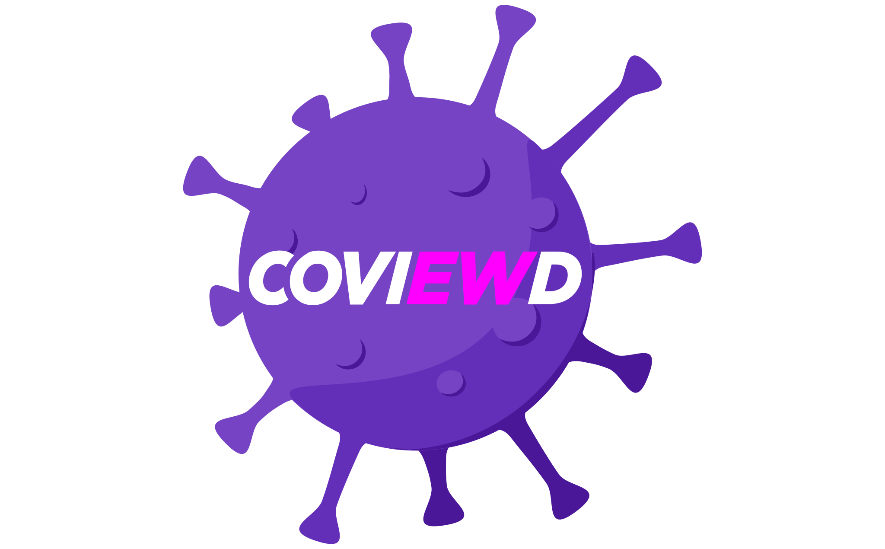

title: I also like to do some personal projects on my free time
featured: banner.jpg
layout: gallery
---

<a class="gallery-item" target="blank" href="https://pokedolar.com.br/">
<figure style="background-image: url(./pokedolar-logo.svg)"></figure>

Fun little side project that get the current Brazilian Real (currency) dolar/euro exchange and represent it in pokemons.

</a><a class="gallery-item" target="blank" href="http://cptmetro.margis.com.br/">
<figure style="background-image: url(./cptmetro-logo.svg)"></figure>

CPTMetro is a WIP project for retrieving the São Paulo Metro and Rails lines status easily. It consist of a crawler, cloud function and webapp.

</a><a class="gallery-item" target="blank" href="https://coviewd.netlify.app/">
<figure style="background-image: url(./covid-logo.svg)"></figure>

Coviewd is a WIP data visualization platform to follow and compare the current moment of the world covid-19 pandemic.

</a><a class="gallery-item" target="blank" href="https://framenimate.netlify.app/">
<figure style="background-image: url(./framenimate-logo.svg)"></figure>

Framenimate is a small javascript plugin to create simple sequential frames animations.

</a>

