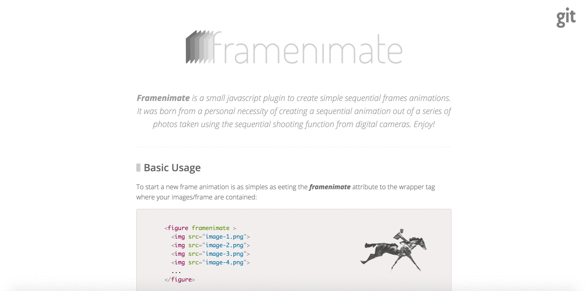

title: I also like to do some personal projects on my free time
featured: banner.jpg
---

## Framenimate

Framenimate is a small javascript plugin to create simple sequential frames animations. It was born from a personal necessity of creating a sequential animation out of a series of photos taken using the sequential shooting function from digital cameras.

Link/URL: [http://framenimate.margis.com.br/](http://framenimate.margis.com.br/)
Github: [https://github.com/vitormargis/framenimate](https://github.com/vitormargis/framenimate)

## Regio

Regio is a small plugin I've been working on for selecting/creating areas in DOM elements. WIP.

### In this project I work with/in:

- Javascript
