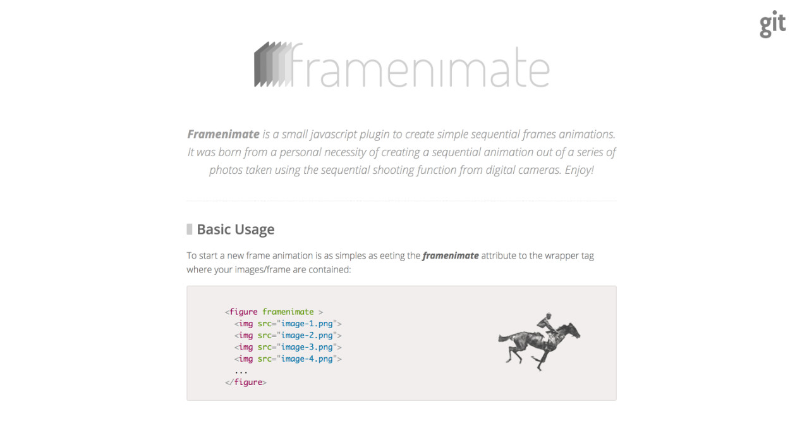

title: I also like to do some personal projects on my free time
featured: banner.jpg
layout: default
---

## Framenimate

Framenimate is a small javascript plugin to create simple sequential frames animations. It was born from a personal necessity of creating a sequential animation out of a series of photos taken using the sequential shooting function from digital cameras.

Link/URL: [http://framenimate.margis.com.br/](http://framenimate.margis.com.br/)
Github: [https://github.com/vitormargis/framenimate](https://github.com/vitormargis/framenimate)

## CPTMetro

CPTMetro is a work in progress project for retrieving the São Paulo Metro and Rails lines status easily. It consist of a wrapper/crawler, used to create an API used by a react app.

Link/URL: [http://cptmetro.margis.com.br/](http://cptmetro.margis.com.br/)
API: [http://api.cptmetro.margis.com.br/](http://api.cptmetro.margis.com.br/)

Crawler/Wrapper: [https://github.com/vitormargis/cptmetro](https://github.com/vitormargis/cptmetro)
Github API: [https://github.com/vitormargis/cptmetro-api](https://github.com/vitormargis/cptmetro-api)
Github Web: [https://github.com/vitormargis/cptmetro-site](https://github.com/vitormargis/cptmetro-site)

## Regio

Regio is a small plugin I've been working on for selecting/creating areas in DOM elements. WIP.

Link/URL: [http://regio.margis.com.br/](http://regio.margis.com.br/)
Github: [https://github.com/vitormargis/regio](https://github.com/vitormargis/regio)
