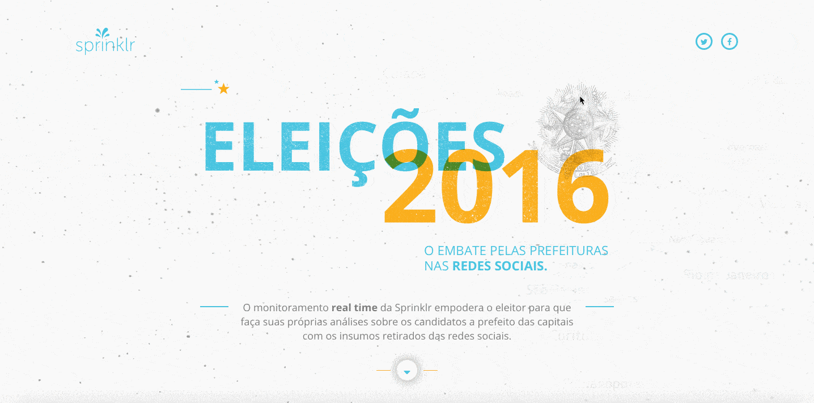
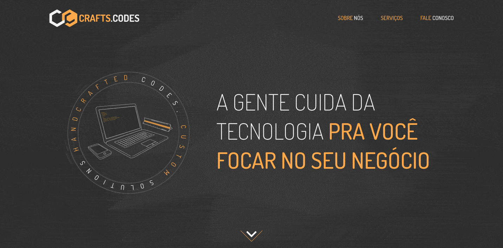

title: Checkout a small selection of recent works for clients & companies
featured: https://cdn-images-1.medium.com/max/1920/1*vXjx4Y7EgQBwALkaeZJ0Cg.jpeg
---
## Sprinklr Business Index

Social media rankings of the Sprinklr Business Index provides social data on how brands are performing online. The Sprinklr Business Index provides business rankings on the social leaders of today.

Link/URL: [https://businessindex.sprinklr.com/](https://businessindex.sprinklr.com/)

### In this project I work with/in:

- Node (Restify)
- Front-end (React/Redux)

## Sprinklr Social Mirror

Social Mirror is a portal with a series oh hotsites aimed to the general public to show interesting data from several recurring events in social medias, like new years, black friday, elections and so on.

Link/URL: [https://socialmirror.sprinklr.com/en/blackfriday](https://socialmirror.sprinklr.com/en/blackfriday)
Link/URL: [https://socialmirror.sprinklr.com/pt/blackfriday](https://socialmirror.sprinklr.com/pt/blackfriday)

### In this project I work with/in:

- UI/UX Developmente
- Front-end (AngularJS)

## Crafts & Codes

Crafts & Codes is a software studio focused in delivering web solutions. Handcrafted codes, custom solutions.

Link/URL (under development): [https://crafts.codes](https://crafts.codes)

### In this project I work with/in:

- UI/UX Developmente
- Layout Conception
- Iconography
- Most of the Front-end (Vanilla)

## GFFCC Decoder

The GFCC Decoder Was a project we made at [Vizir Sfotware Studio](http://vizir.com.br) for the Global Federation of Competitiveness Councils. The project basic goal was to build a plataform gathering competitiviness data from around the world, to help country governments by giving them a better and clearer view of which aspects to invest to become a greater player in the global scenario.

Link/URL: [http://decoder.thegfcc.org/](http://decoder.thegfcc.org/)

### In this project I work with/in:

- UI/UX Developmente
- Layout Conception
- Iconography
- Most of the Front-end
