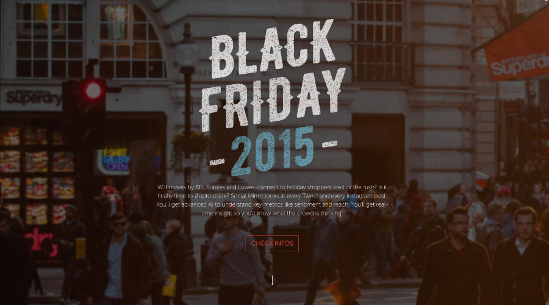
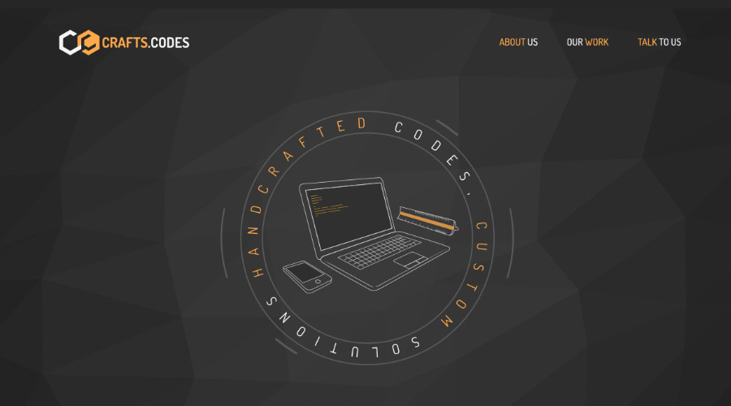
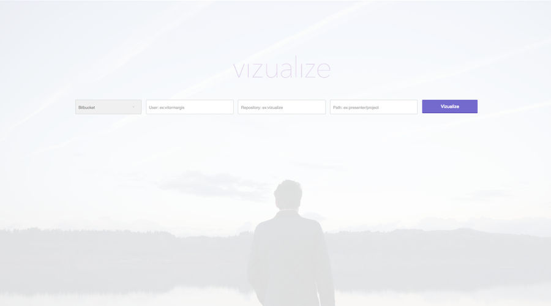

title: Checkout Some Works
---

## Sprinklr Social Mirror

Social Mirror is a portal with a series oh hotsites aimed to the general public to show interesting data from several recurring events in social medias, like new years, black friday, elections and so on.

Link/URL: [https://socialmirror.sprinklr.com/en/blackfriday](https://socialmirror.sprinklr.com/en/blackfriday)
Link/URL: [https://socialmirror.sprinklr.com/pt/blackfriday](https://socialmirror.sprinklr.com/pt/blackfriday)

### In this project I work with/in:

- UI/UX Developmente
- Front-end (AngularJS)

## Framenimate

Framenimate is a small javascript plugin to create simple sequential frames animations. It was born from a personal necessity of creating a sequential animation out of a series of photos taken using the sequential shooting function from digital cameras.

Link/URL: [http://framenimate.margis.com.br/](http://framenimate.margis.com.br/)
Github: [https://github.com/vitormargis/framenimate](https://github.com/vitormargis/framenimate)

## Crafts & Codes

Crafts & Codes is a software studio focused in delivering web solutions. Handcrafted codes, custom solutions.

Link/URL (under development): [https://crafts.codes](https://crafts.codes)

### In this project I work with/in:

- UI/UX Developmente
- Layout Conception
- Iconography
- Most of the Front-end

## GFFCC Decoder

The GFCC Decoder Was a project we made at [Vizir Sfotware Studio](http://vizir.com.br) for the Global Federation of Competitiveness Councils. The project basic goal was to build a plataform gathering competitiviness data from around the world, to help country governments by giving them a better and clearer view of which aspects to invest to become a greater player in the global scenario.

Link/URL: [http://decoder.thegfcc.org/](http://decoder.thegfcc.org/)

### In this project I work with/in:

- UI/UX Developmente
- Layout Conception
- Iconography
- Most of the Front-end

## Edenred Ticker Car

Also made here at [Vizir Sfotware Studio](http://vizir.com.br), this project is under current development for Edenred Brazilian Division - Ticket Car. We were hired mainly to rebuild their's old system from the ground with a newer technology, in this case, Angular.

Link/URL: [Sales and Simulation](https://www.pedidosticketcar.com.br/front/#/sales/simulation)
Link/URL: [Client Login](https://www.pedidosticketcar.com.br/client/#/login)
Link/URL: [Screenshots](http://vizualize.margis.com.br/#/github/vitormargis/vizualize/presenter+layouts/)

### In this project I work with/in:

- UI/UX Base Developmente
- Front-end

## Vizualize

Vizulize is a work in progress project of mine that you can sneak in Github. It is currently in it's early stages. The ideia is to use Git repositories, and other sources in the future, to generate presentation. We've been using it in out officce to present interfaces to out clients.

New Version: [http://vizualize.margis.com.br/](http://vizualize.margis.com.br/#/github/vitormargis/vizualize/presenter+layouts/0)
Github: [https://github.com/vitormargis/vizualize](https://github.com/vitormargis/vizualize)

### In this project I work with/in:

- UI/UX Developmente
- Layout Conception
- Iconography
- Most of the Front-end

## Mais Asas

An oldie but a cool one, [Mais Asas](http://maisasas.com.br) is a starup/platform for turist that want to go to Rio de Janeiro and expirience the city has to offer through the eyes of a local.

Link/URL: [http://maisasas.com.br/](http://maisasas.com.br/)

### In this project I work with/in:

- UI/UX Developmente
- Layout Conception
- Most of the Front-end
- Some bits of Rails
